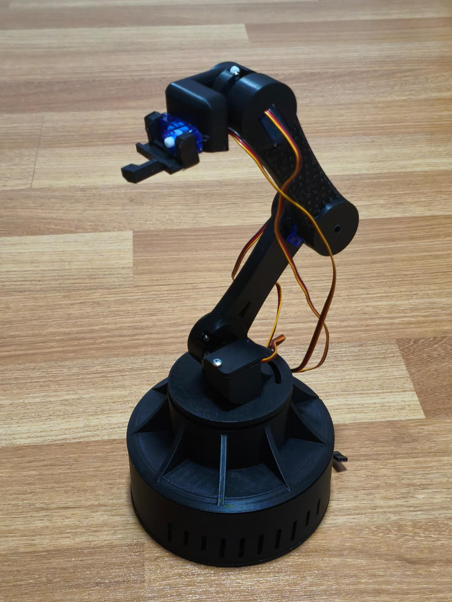
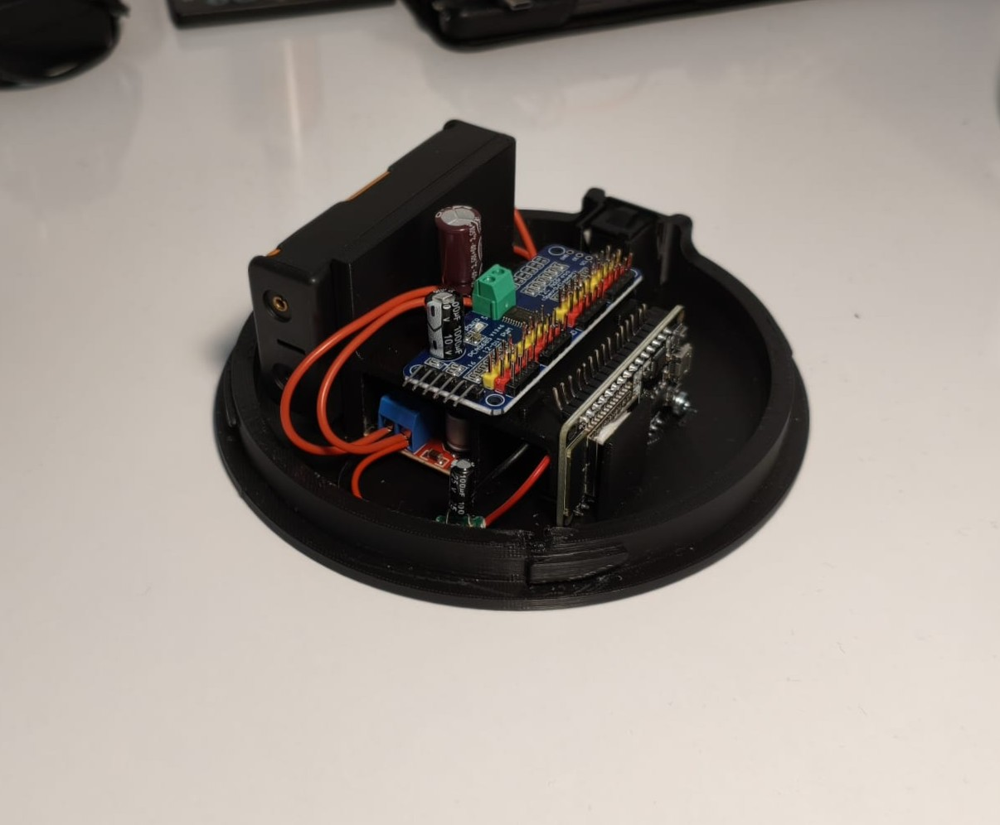

# ESP32 5-DOF Manipulator

<p align="center">
  
</p>

A custom-built 5-axis robotic manipulator. This project focuses on non-blocking network communication, kinematic stability, and hardware-level PWM offloading to achieve precise, jitter-free servo control.

## ⚙️ Mechanical Design

<p align="center">
  
</p>

All structural components are 3D-printed in PETG. This material was chosen to minimize mechanical flex under load and provide higher thermal resistance compared to standard PLA, maintaining a rigid frame while keeping the overall moving mass low.

## ⚡ Hardware Architecture & Component Selection

Rather than connecting actuators directly to the microcontroller, this project utilizes a dedicated power and signal distribution architecture to ensure system stability.

<p align="center">
  
</p>

<p align="center">
  
</p>

* **Microcontroller (ESP32 WROOM-32):** Selected for its built-in Wi-Fi capabilities and dual-core architecture, allowing network tasks to run independently without blocking motion calculations.
* **PWM Offloading (Adafruit PCA9685):** Generating PWM signals directly from the ESP32 while handling Wi-Fi interrupts often leads to signal jitter (mechanical twitching/oscillation). The PCA9685 offloads this task via I2C (`0x40`), generating a rock-solid, uninterrupted 50Hz hardware PWM signal for flawless servo rotation.
* **Voltage Regulation (XL4015 DC-DC Buck):** Servos draw high peak currents under heavy loads. The XL4015 safely steps down the unregulated battery voltage to a stable `5.0V`. This protects the delicate ESP32 logic and the servo motors from overvoltage, while providing enough current capacity to prevent system reboots.
* **Actuators (5x MG90S):** Metal gear micro servos were chosen over standard nylon gears (SG90) for their superior torque and durability without increasing the mechanical footprint.
* **Power Filtering:** 100µF and 1mF decoupling capacitors are placed across the power rails to absorb inductive spikes caused by motor stalls, ensuring clean power delivery to the MCU.

## 💻 Firmware Implementation

* **Asynchronous Web Control:** WebSocket communication and web server operations run asynchronously (`ESPAsyncWebServer`). The main loop is dedicated entirely to calculating kinematics, preventing motion lag during heavy network traffic.
* **Custom Motion Profiling (`SmartServo`):** Standard libraries drive servos to their target at maximum speed, causing severe structural wobble. The custom `SmartServo` C++ class implements independent speed and step-delay parameters. This allows the load-bearing base to move smoothly and slowly, while the gripper can react instantly.
* **Soft-Start Homing:** On boot, a low-speed homing routine safely drives all joints to a neutral 90-degree position. This prevents the massive inrush current spike that occurs when 5 servos wake up at maximum draw simultaneously.

## 🚀 Getting Started

### Prerequisites
* [PlatformIO](https://platformio.org/) or Arduino IDE
* Required Libraries: `Adafruit PWM Servo Driver Library`, `ESPAsyncWebServer`, `AsyncTCP`

### Installation
1. Clone the repository:
   ```bash
   git clone https://github.com/erayfazilordanuc/esp-5dof-manipulator.git
   ```
2. Navigate to the firmware directory:
   ```bash
   cd esp-5dof-manipulator/firmware
   ```
3. Copy `secrets_example.h` to `secrets.h` and configure your Wi-Fi credentials.
4. Build and flash the firmware to your ESP32.

## 🌐 Upcoming Work: ROS 2 Integration

This firmware serves as the low-level hardware interface for a future autonomous setup. Planned updates:
* **micro-ROS:** Bridging the ESP32 with a host machine.
* **URDF:** Generating an accurate physical model for simulations.
* **MoveIt 2:** Integrating Inverse Kinematics (IK) and trajectory planning.

## 📂 Directory Structure

* `/cad` - Mechanical assembly references, STEP files, and print-ready STLs.
* `/electronics` - Circuit schematics and wiring diagrams.
* `/docs` - Project media, hardware integration photos, and reference sheets.
* `/firmware` - ESP32 source code, custom classes, and environment configurations.
* `/ros2_ws` - Workspace for upcoming ROS 2 packages and launch files.