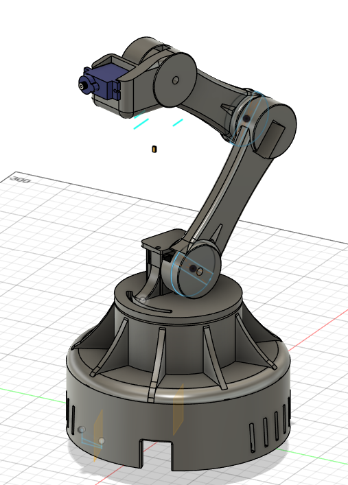

# ESP32 5-DOF Manipulator

  

This repository contains the firmware, hardware schematics, and mechanical overview for a custom 5-axis robotic arm. The system is built around an ESP32 C3 and a PCA9685 PWM driver, focusing on non-blocking network communication and structural stability during movement.

## System Design & CAD

  

The mechanical structure was designed with kinematic stability in mind, utilizing 3D-printed PETG parts to ensure a rigid frame while maintaining a lightweight profile for the servos.

## Technical Implementation

Instead of a basic remote-control script, this project implements a few critical systems to ensure smooth and reliable operation:

* **Asynchronous Web Control:** The web server and WebSocket communication run asynchronously. The main MCU loop is dedicated entirely to calculating servo positions, which prevents motor jitter when network packets are received.
* **Motion Profiling (`SmartServo`):** Moving all servos at their maximum default speed causes structural wobble and high current spikes. A custom C++ class assigns independent speed/step parameters to each joint. The load-bearing base moves slower, while the gripper operates faster.
* **Hardware PWM Offloading:** Generating PWM signals directly from the ESP32 while handling Wi-Fi can lead to timer conflicts. This design offloads pulse generation to an external PCA9685 module via I2C, ensuring a clean, constant 50Hz signal.
* **Soft-Start Homing Sequence:** To avoid brownouts caused by sudden inrush currents on boot, the system initializes with a low-speed homing routine, safely bringing all joints to a known 90-degree position before accepting external commands.

## Hardware Setup & Electronics

  

* **Microcontroller:** ESP32 C3 Super Mini
* **Actuator Driver:** Adafruit PCA9685 (I2C Address: 0x40)
* **Actuators:** 5x MG90S Metal Gear Micro Servos
* **Power Supply:** XL4015 DC-DC Buck Converter (Stepped down to 5V)
* **Filtering:** 100µF and 1mF decoupling capacitors placed across the power rails to suppress inductive spikes.

## Upcoming Work (ROS 2 Integration)

The current firmware serves as a foundation for transitioning the manipulator into an autonomous system. Planned updates include:
* Bridging the ESP32 to a host machine using `micro-ROS`.
* Generating a URDF model for the 3D-printed parts.
* Implementing MoveIt 2 for Inverse Kinematics (IK) and trajectory planning.

## Directory Structure

* `/cad` - Mechanical assembly references and print files.
* `/docs` - Circuit diagrams, hardware photos, and pinout references.
* `/firmware` - Source code (main application and custom class structures).
* `/ros2_ws` - Workspace for upcoming ROS 2 integration.