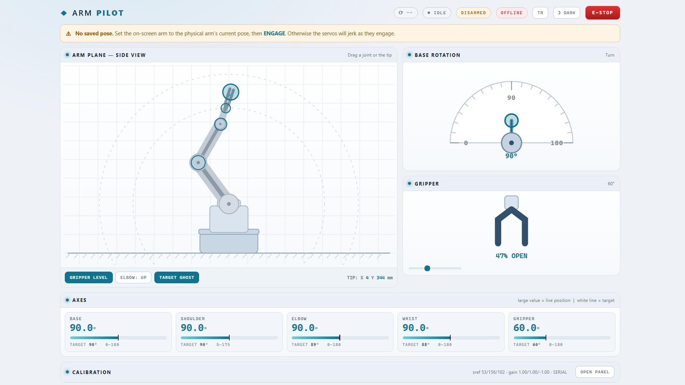

# ESP32 5-DOF Manipulator

<p align="center">
  
  
</p>

A five-axis robotic arm built from scratch: a 3D-printed structure, an ESP32 running the
motion controller, and a control page served straight off the board over Wi-Fi. No host
computer involved. The firmware is called ArmPilot.

The arm is driven by servos that report nothing back — no encoder, no current sense, no way
to ask one where it is. Three problems follow, and most of the design answers one of them:

- A servo that has just been powered up slams to whatever pulse width reaches it first, so
  firmware that attaches and writes an angle in the same breath makes the arm jump on boot.
- Software PWM on a chip that is also servicing Wi-Fi interrupts jitters — audible as
  buzzing, visible as twitching.
- Commanding a servo straight to its target makes it accelerate as hard as it can, which on
  a printed arm means wobble on departure and overshoot on arrival.

This is an open-loop system. The firmware controls what it *commands*; whether a link ended
up where it was told is not something the board can observe.

## Mechanics

<p align="center">
  
  
</p>

Structural parts are printed in PETG rather than PLA, for less flex under load and better
tolerance of the heat that builds up around servos in a sealed base. The section view was the
working drawing for servo clearance, cable routing and wall thickness. The base is a closed
cylinder holding the electronics and battery, keeping the heaviest parts at the bottom and
the arm planted when the elbow is fully extended.

STLs are in [`cad/print_files/`](cad/print_files/), Fusion 360 sources in
[`cad/source/`](cad/source/). The browser draws the arm from link lengths the board sends on
connect, so changing the mechanics means editing one struct: base radius 62 mm, floor to
shoulder 105 mm, shoulder to elbow 110 mm, elbow to wrist 95 mm, wrist to tip 72 mm.

## Electronics


All five PWM channels come from a PCA9685 at I²C `0x40` rather than the ESP32 itself. It
generates the pulses in hardware at 50 Hz while the ESP32 only writes a pulse width over the
bus at 400 kHz, so whatever the CPU is busy with never reaches the servo signal.

Two 18650 cells in series feed a single XL4015 buck converter, which supplies the ESP32 and
the servo rail in parallel — 100 µF on the logic side, 1000 µF across the servo rail. It is
still one rail, so a hard stall can drag the logic down with it. Splitting them is the next
revision: [`circuit_diagram_v2.png`](electronics/circuit_diagram_v2.png) gives the servos a
dedicated 8 A XL4016E1, and
[`circuit_diagram_v2_with_bms.png`](electronics/circuit_diagram_v2_with_bms.png) adds a 2S BMS
and USB-C charging.

| Qty | Part | Notes |
|---|---|---|
| 1 | ESP32-WROOM-32 devkit, 30-pin | Wi-Fi and two cores |
| 1 | Adafruit PCA9685 | 16-channel 12-bit PWM, I²C `0x40` |
| 3 | MG90S servo | Base, shoulder, elbow |
| 2 | SG90 servo | Wrist and gripper |
| 1 | XL4015 buck converter | Shared 5 V rail |
| 2 | 18650 Li-ion and holder | In series, about 7.4 V nominal |
| 1 each | 100 µF / 1000 µF electrolytic | Logic side / servo rail |
| 2 | Rocker / slide switch | Master and logic cut-off |

`GPIO21`/`GPIO22` carry I²C, `3V3` feeds the PCA9685 logic, grounds are common. Any 50 Hz
servo works in place of these; trim each axis with `usMin`/`usMax` in the joint table.

<p align="center">
  
  
</p>

## Motion control

Without position feedback a PID loop has nothing to close around, so instead of correcting
error after the fact ArmPilot never commands a move the arm cannot follow. Every axis owns a
profile generator ([`motion_axis.h`](firmware/include/motion_axis.h)) stepped at 100 Hz,
handing the servo an intermediate setpoint every 10 ms under velocity, acceleration and jerk
limits.

```
velocity
   ^      ______________
   |     /              \     jerk limit smooths the take-off
   |    /                \    v = sqrt(2*a*distance) brake curve
   +---/------------------\--> time
```

The asymmetry is the point: jerk is limited only while accelerating, while braking keeps full
acceleration authority. Velocity is capped at `sqrt(2*a*distance)` from the target, so the
commanded setpoint arrives and stops rather than sailing past — a property of the generator,
not a correction applied afterwards. What the physical link then does is unobservable, and
none of this compensates for disturbance or a stalled servo.

Profile stepping runs in its own FreeRTOS task, pinned to core 1 at priority 3 with a fixed
period. Telemetry and WebSocket work happen in the lower-priority Arduino loop, so a busy
network is what gets preempted — the control step runs on time and the web work waits.

**[docs/motion-control.md](docs/motion-control.md)** — per-axis limits, profile output for a
90° move, the `s`/`s²`/`s³` speed-scaling law, task layout.

## The control page



The UI is a single page held in flash as `PROGMEM`, so there is no filesystem image to build
or upload. It gives two 2D views instead of five sliders, because sliders make you think in
servo angles and the shape of the robot is what you care about: a side view where dragging
the end point solves shoulder and elbow together through inverse kinematics, and a top view
dial for base rotation.

The solid arm is the setpoint the profile generator is commanding, streamed at 20 Hz; the
dashed ghost is the target it is working toward, fading as the two converge. Both come from
the firmware's model rather than from the arm itself, so the gap between them is how much of
the commanded move is still outstanding, not a tracking error. `Space` is emergency stop and
resume, `H` is home, `P` is park. English and Turkish come from one dictionary and the theme
follows the OS until overridden; both choices stay in `localStorage`, which is why the boot
reason arrives from the board as a code (`BROWNOUT`, `PANIC`, …) and is put into words in the
browser.

**Calibration** lives in the same page. Splined horns mount at whatever tooth lines up during
assembly, so each joint carries a linear map — `joint = wRef + gain * (servo - sRef)` —
instead of an assumed zero, and the sign of `gain` carries direction, so the reversed wrist
mount is just −1. Two unknowns need two samples: engage, pose the arm, drag the on-screen arm
to match, save two clearly different poses. The firmware fits and stores them, and rejects
fits it cannot trust, because a bad fit turns into motion. See
**[docs/calibration.md](docs/calibration.md)**.

Commands go over a WebSocket at `/ws` as plain text:

```
a <a0> <a1> <a2> <a3> <a4>   set all axes
j <id> <deg>                 set one axis
s <scale>                    speed scale, 0.15 to 1.30
c engage|release|home|park|stop|resume|save
k ...                        calibration: sample, solve, flip direction, reset
```

The board answers with a `hello` frame (geometry, joint limits, IP, last reset code), a `cal`
frame whenever calibration changes, and a 20 Hz state packet.

## Starting up without the jump

At boot ArmPilot emits no pulses at all: `ArmController::begin()` puts every PCA9685 channel
into full-off, so the servos stay torque-free and the arm cannot move until asked.

Two seconds after motion settles the joint angles go to NVS. On the next boot they are read
back as the assumed pose, and pressing engage writes that *stored* angle to each channel in
turn, 220 ms apart: the commanded angle already matches the physical one so nothing moves,
and staggering keeps the inrush from pulling the supply down. With no stored pose — or if the
arm was moved by hand while off — the page says so and asks you to match the on-screen arm to
the real one first.

What this cannot fix: if the ESP32 resets, outputs shut off and the arm drops under its own
weight. The servos have no brake. Wiring `/OE` to a GPIO lets the firmware kill outputs in
hardware too, but it does not hold the arm up.

## Build and flash

You need [PlatformIO](https://platformio.org/); dependencies resolve from `platformio.ini`.

```bash
git clone https://github.com/erayfazilordanuc/esp-5dof-manipulator.git
cd esp-5dof-manipulator/firmware

# Wi-Fi credentials are not kept in version control
cp include/secrets_example.h include/secrets.h   # then fill in SSID and password

pio run              # build
pio run -t upload    # flash
pio device monitor   # the IP address is printed here
```

If the network is unreachable the board brings up its own access point, `ArmPilot-AP` /
`armpilot1`, at `http://192.168.4.1`; on your own network `http://armpilot.local` works over
mDNS. The servos come up free by design — press engage in the UI to energise them.

`python tools/preview.py` extracts the embedded page and serves it on `localhost`, so UI work
does not need a flash cycle. Tuning is split between `firmware/include/config.h` (AP fallback,
I²C pins, control rate, boot behaviour) and `firmware/src/config.cpp` (joint table, link
geometry, calibration defaults); both are pushed to the browser on connect.

## When the servos go limp

Almost always the ESP32 has reset: outputs shut off, torque disappears, the arm sags. The
cause is captured on boot and reported as `BROWNOUT`, `PANIC` or `WATCHDOG`, and the page
also watches uptime — if it runs backwards while you are connected, the board restarted under
you and the badge says so. Brownout is the usual answer on a shared rail: give the servos
their own 5–6 V supply, tie the grounds together, keep 1000 µF across the rail.
`ENGAGE_STAGGER_MS` spreads out the start-up current, but peak current during a move is a
question of what the supply can deliver.

## Repository layout

```
cad/          print_files/ (STLs + v1 archive), renders/, source/ (Fusion 360)
docs/         motion-control.md, calibration.md, media/
electronics/  Circuit diagrams, plus legacy/ for the v1 schematic
firmware/     include/, src/, tools/preview.py, legacy/ (excluded from the build)
```

## What's next

Closing the loop is the gap worth naming: an IMU on the forearm, or angles pulled from
high-frame-rate video, would make the pose the arm actually reaches measurable and turn the
profile numbers from commanded into observed. Past that, this firmware is meant to become the
low-level hardware interface for an autonomous setup — micro-ROS bridging the board to a host,
a URDF model to simulate against, and MoveIt 2 planning off-board.
