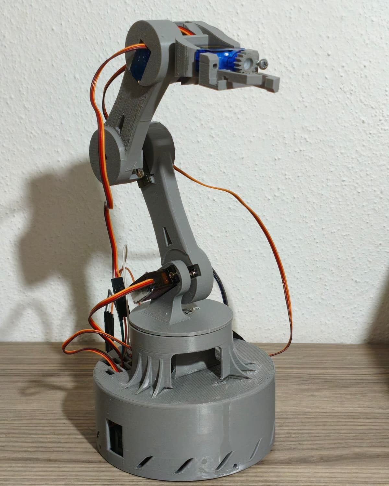
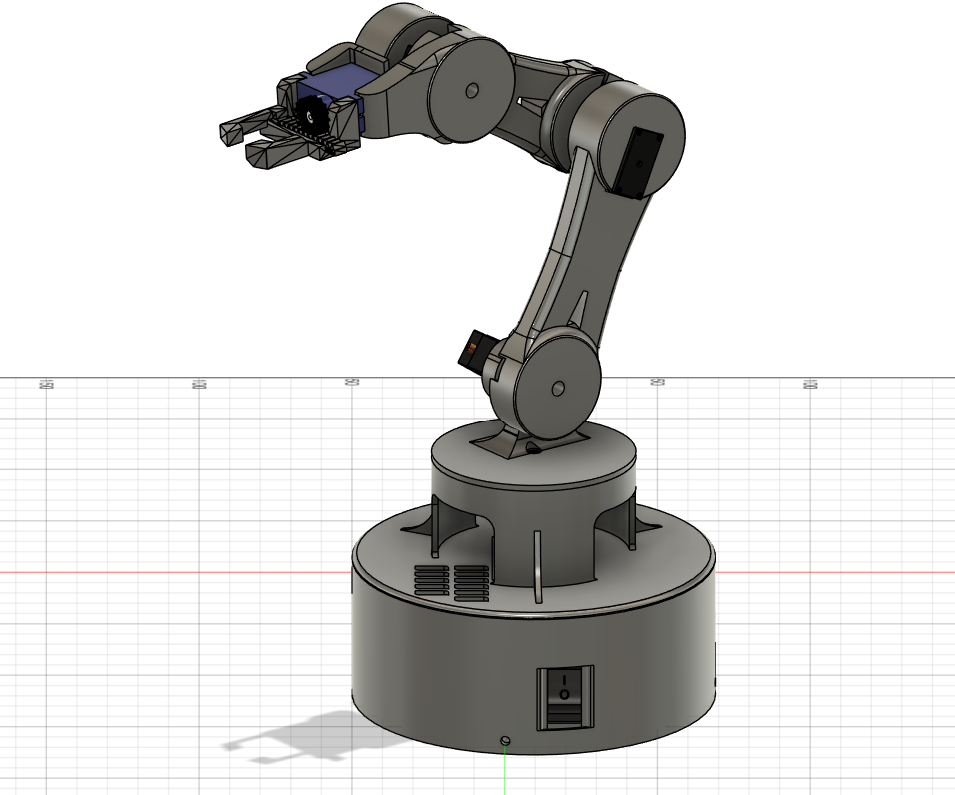
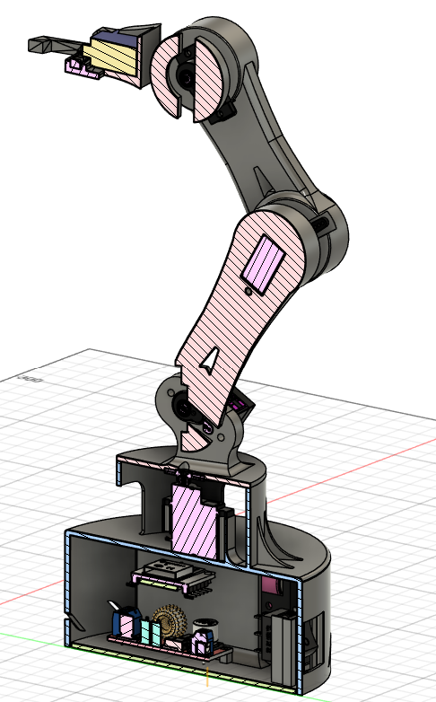
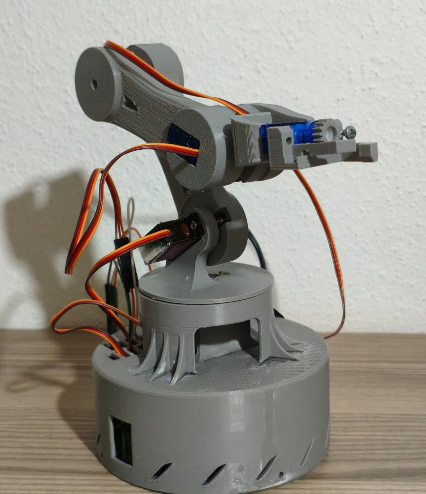
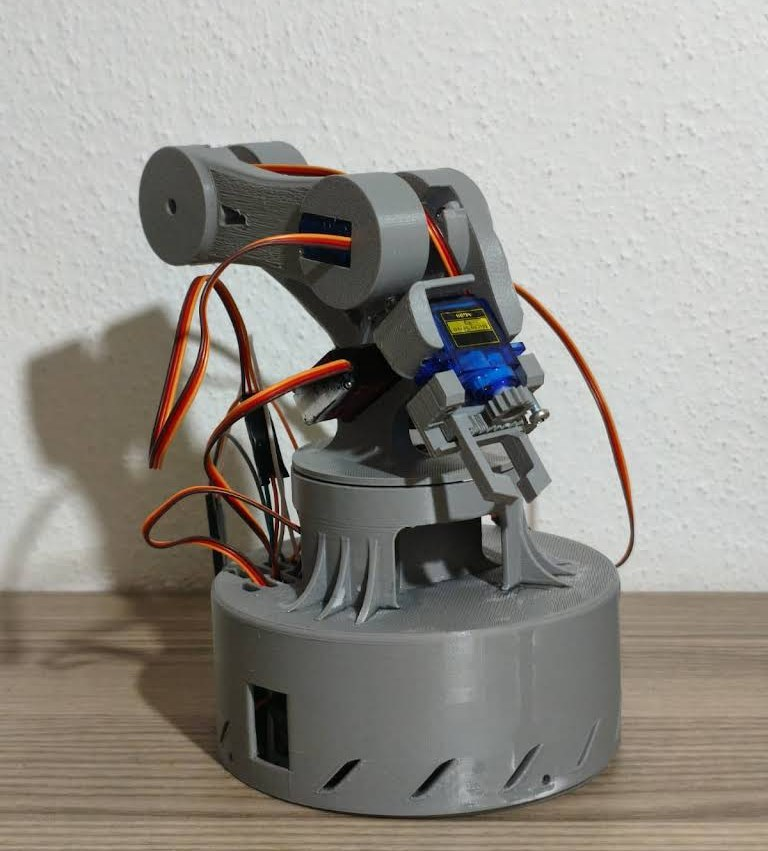
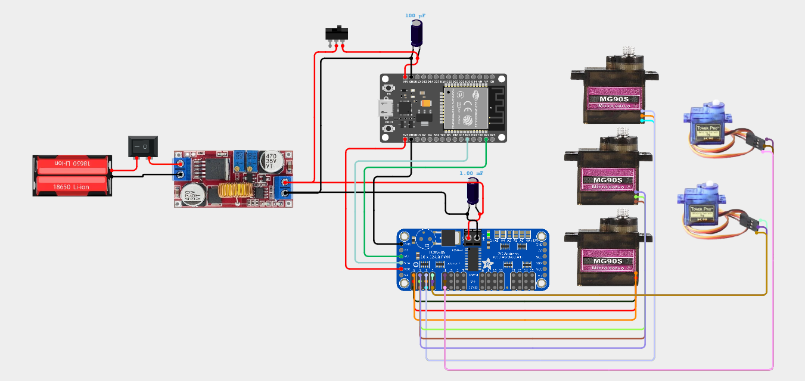
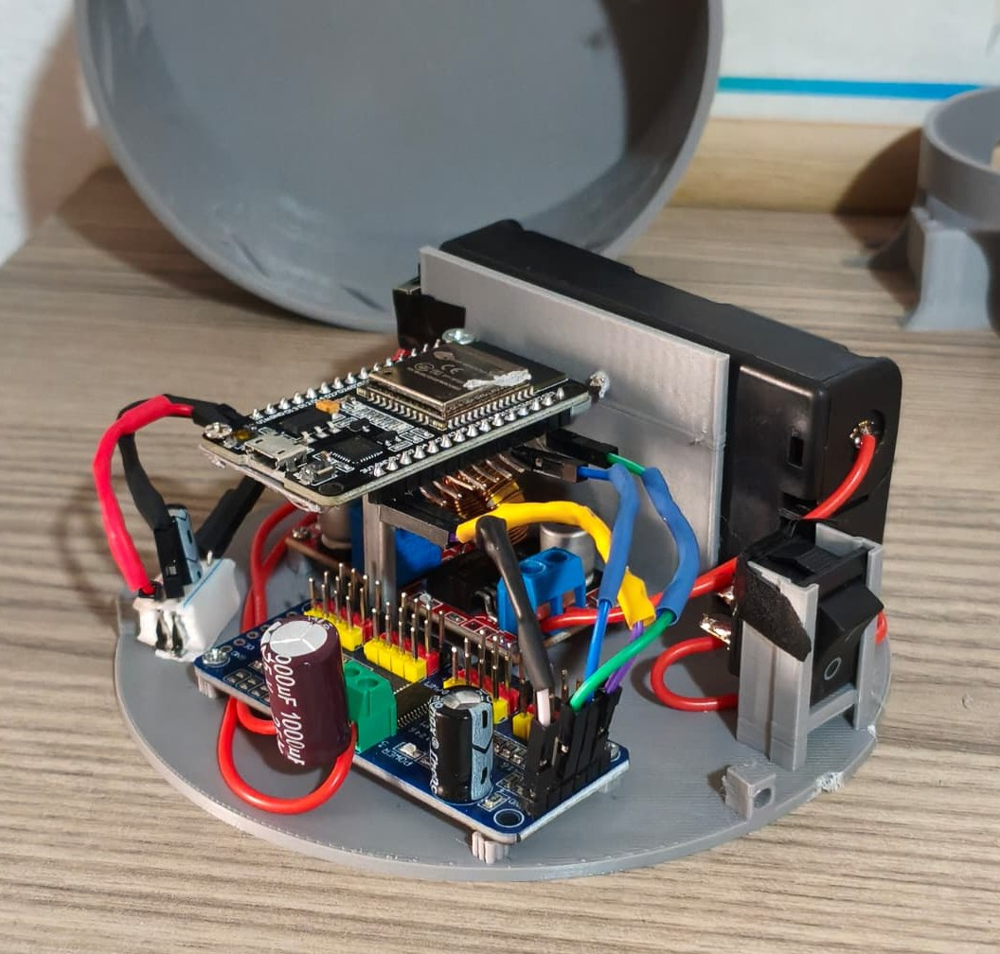
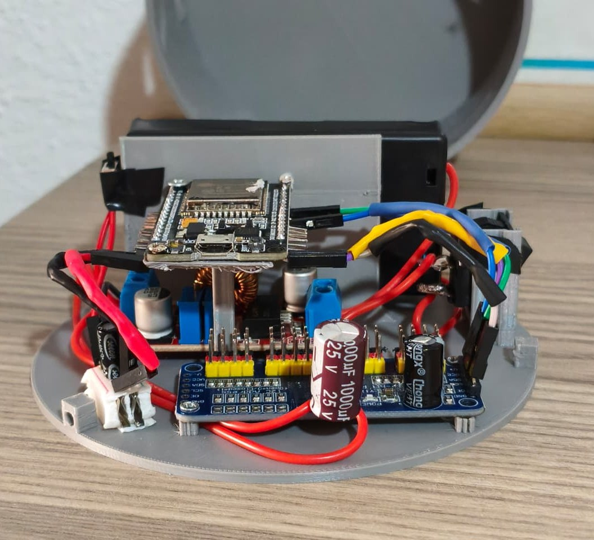
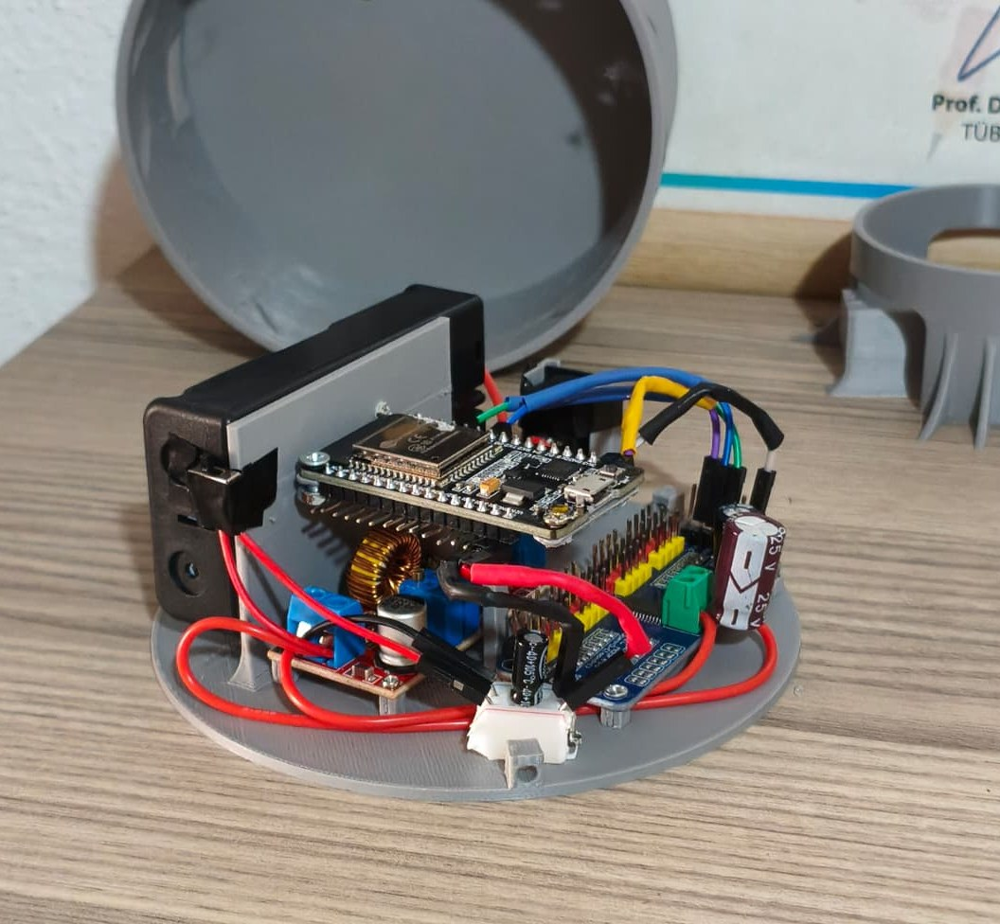

# ESP32 5-DOF Manipulator — *ArmPilot*

<p align="center">
  
</p>

<p align="center">
  
  
  
  
</p>

A custom-built 5-axis robotic manipulator: 3D-printed structure, an ESP32 brain, and a
browser-based control surface reached over Wi-Fi. The design goal was never "make the servos
move" — it was to make them move *predictably*: no start-up jump, no wobble on acceleration,
no overshoot at the target, and no motion hiccups while the network is busy.

Hobby servos have **no position feedback**, so a classical PID loop is impossible. ArmPilot
attacks the same problem from the other side: a **velocity / acceleration / jerk-limited
profile generator** runs at a fixed 100 Hz on a dedicated core and feeds the servos
intermediate setpoints, producing PID-like smoothness on open-loop hardware.

---

## Highlights

| | |
|---|---|
| **No boot jump** | On power-up not a single pulse is emitted. Servos stay torque-free until you explicitly engage them — see [Safe boot](#safe-boot--state-machine). |
| **Shape-based control** | You don't drag five sliders. You drag the *robot*: a 2D side view with inverse kinematics, plus a top-view dial for the base. |
| **Motion profiling** | Jerk-limited take-off, full-authority braking. Measured overshoot: `0.0000°`. |
| **Two-point calibration** | Servo horns mount at arbitrary angles. A guided in-browser routine solves the servo→joint mapping and stores it in NVS. |
| **Motion never stutters** | Profile generation lives in its own FreeRTOS task pinned to core 1; Wi-Fi traffic cannot delay it. |
| **Reset diagnostics** | Brownout / panic / watchdog resets are captured and surfaced in the UI — the usual answer to "why did my arm suddenly go limp". |

---

## Mechanical Design

<p align="center">
  
  
</p>

All structural components are 3D-printed in PETG — chosen over PLA to minimise flex under load
and to survive the heat soak from servos enclosed in the base, while keeping the moving mass
low. The section view above was used to verify servo clearance, cable routing channels and
wall thickness before committing to a print.

The base is a sealed cylinder carrying the entire electronics stack and the battery, which
keeps the centre of mass low and the arm planted when the elbow is fully extended.

<p align="center">
  
  
</p>

### Print files

Print-ready STLs live in [`cad/print_files/`](cad/print_files/); editable Fusion 360 sources are
in [`cad/source/`](cad/source/).

| Part | Role |
|---|---|
| `Base Housing.stl` | Outer base cylinder — electronics bay, switch cut-out, vents |
| `Base Lid.stl` | Electronics mounting plate / base cover |
| `Servo Shoulder Center.stl` | Shoulder servo carrier |
| `J1 Lid.stl` | Axis 1 (base yaw) turntable lid |
| `J2 Arm.stl` | Axis 2 link — upper arm |
| `J3 Arm.stl` | Axis 3 link — forearm |
| `J4 wHousing.stl` | Axis 4 wrist, with integrated servo housing |
| `Gripper Mount.stl` · `Gripper Round Gear.stl` · `Gripper Gear and Finger.stl` | Parallel gripper drivetrain |
| `after the base prints.3mf` | Pre-arranged build plate for the non-base parts |

Superseded v1 parts are archived under [`cad/print_files/v1/`](cad/print_files/v1/).

### Link geometry

The browser draws the arm from these numbers, which the ESP32 sends on connect — change the
mechanics, change one struct, and the UI follows. Defined in `firmware/src/config.cpp`:

| Dimension | Value |
|---|---|
| Base radius (visual) | 62 mm |
| Floor → shoulder axis | 105 mm |
| Shoulder → elbow | 110 mm |
| Elbow → wrist | 95 mm |
| Wrist → gripper tip | 72 mm |

---

## Electronics

<p align="center">
  
</p>

Actuators are never driven from the microcontroller. Power and signal are split into
independent paths so that a stalling servo cannot brown out the logic:

* **Microcontroller — ESP32-WROOM-32.** Built-in Wi-Fi and two cores, so networking and motion
  generation genuinely run in parallel instead of taking turns.
* **PWM offloading — Adafruit PCA9685 (I²C `0x40`).** Generating five PWM channels from the
  ESP32 while Wi-Fi interrupts fire produces visible jitter — servos twitch and buzz. The
  PCA9685 synthesises a rock-solid 50 Hz hardware PWM in its own silicon; the ESP32 only writes
  a pulse width over I²C at 400 kHz.
* **Split rails — two buck converters.** An **XL4015** feeds the ESP32; an **8 A XL4016E1** feeds
  the servo rail. Servo inrush therefore never drags the logic supply down.
* **Bulk decoupling.** 100 µF on the ESP32 rail, 1000 µF across the servo rail, to absorb the
  inductive spikes of a stalled motor.
* **Battery — 2 × 18650 Li-ion in series**, master toggle switch on the positive line, with a
  second switch isolating the ESP32 rail.

A variant with a 2S BMS and USB-C charging is documented in
[`electronics/circuit_diagram_with_bms.png`](electronics/circuit_diagram_with_bms.png).

### Bill of materials

| Qty | Part | Notes |
|---|---|---|
| 1 | ESP32-WROOM-32 devkit (30-pin) | Wi-Fi + dual core |
| 1 | Adafruit PCA9685 | 16-ch 12-bit PWM, I²C `0x40` |
| 3 | MG996R servo | High-torque axes — base, shoulder, elbow |
| 2 | MG90S servo | Wrist and gripper |
| 1 | XL4015 buck converter | Logic rail |
| 1 | XL4016E1 8 A buck converter | Servo rail |
| 2 | 18650 Li-ion + holder | Series, ≈7.4 V nominal |
| 1 | 100 µF electrolytic | ESP32 rail decoupling |
| 1 | 1000 µF electrolytic | Servo rail decoupling |
| 2 | Toggle / slide switch | Master and logic-rail cut-off |

> Servo models describe the current build. Any 50 Hz hobby servo works — trim each axis with
> `usMin` / `usMax` in the joint table.

### Wiring

| ESP32 | | Target |
|---|---|---|
| `GPIO21` | → | PCA9685 `SDA` |
| `GPIO22` | → | PCA9685 `SCL` |
| `3V3` | → | PCA9685 `VCC` (logic only) |
| `GND` | → | Common ground, both rails |
| `VIN` | ← | XL4015 output, via switch + 100 µF |

| PCA9685 channel | Axis |
|---|---|
| `ch0` | Base yaw |
| `ch1` | Shoulder |
| `ch2` | Elbow |
| `ch3` | Wrist pitch |
| `ch4` | Gripper |

Servo power (`V+`) comes from the XL4016E1 rail, **not** from the PCA9685 logic pins.

### Integration

<p align="center">
  
</p>

The whole stack — ESP32, PCA9685, both converters, battery holder and master switch — is packed
onto the base plate and closed inside the base cylinder.

<p align="center">
  
  
</p>

---

## Firmware

### Architecture

```
Core 1 / prio 3   motion task   100 Hz fixed period — profile step + PCA9685 write
Arduino loop      telemetry      20 Hz state broadcast, WebSocket housekeeping
AsyncTCP task     commands       WebSocket → spinlock-protected target buffer
```

Because motion lives in its own pinned task, heavy network traffic changes *nothing* about how
the arm moves. The control UI is a single page held in flash (`PROGMEM`) and streamed straight
from there — no filesystem, no SPIFFS image to upload.

### Safe boot & state machine

Hobby servos don't know where they are. Energise one and it slams to whatever pulse arrives
first — which is why a naive `attach()`-then-write firmware makes the arm jump on every boot.

ArmPilot removes the jump in three steps:

1. **No pulses at boot.** `ArmController::begin()` sets every PCA9685 channel to full-off.
   Servos stay torque-free; the arm physically cannot move. State: `DISARMED`.
2. **Last pose persists.** Roughly 2 s after motion settles, the joint angles are written to
   NVS. On boot they are read back and shown in the UI as the assumed current pose.
3. **Staggered engage.** Pressing *engage* writes the **stored** angle to each channel in turn,
   220 ms apart. The commanded angle equals the physical angle, so nothing moves — and because
   channels wake one at a time, there is no inrush spike to collapse the supply.

If the arm was moved by hand while powered down, drag the on-screen arm to match reality first,
then engage — still no jump.

| State | Meaning |
|---|---|
| `DISARMED` | Outputs off, servos free — the safe boot state |
| `ENGAGING` | Channels being energised one by one |
| `ACTIVE` | Normal operation |
| `ESTOP` | Emergency stop — position held, motion frozen |

Boot behaviour is configurable in `firmware/include/config.h`:

```c
#define AUTO_ENGAGE_ON_BOOT    false  // true: lock into the stored pose at boot
#define AUTO_HOME_AFTER_ENGAGE false  // true: then creep to HOME
```

### Motion profiling

Each axis runs an independent profile generator (`firmware/include/motion_axis.h`), stepped
every 10 ms:

```
velocity
   ^      ______________
   |     /              \     <- jerk limit smooths the take-off
   |    /                \    <- v = sqrt(2*a*distance) brake curve, no overshoot
   +---/------------------\--> time
```

The jerk limit applies **only while accelerating**. On the braking side full acceleration
authority is left available, which is what guarantees the axis never overshoots. Retargeting
mid-move is seamless: the profile continues from the current velocity rather than restarting.

Measured, 90° move at the default 0.85× scale:

| Axis | Duration | Peak velocity | Distance covered in first 100 ms |
|---|---|---|---|
| Base | 3.52 s | 34 °/s | 2 % |
| Shoulder | 4.39 s | 25 °/s | 2 % |
| Elbow | 2.27 s | 60 °/s | 3 % |
| Wrist | 1.82 s | 81 °/s | 4 % |
| Gripper | 1.41 s | 111 °/s | 5 % |

Base and shoulder are deliberately the slowest — they carry the most inertia and load. The
**speed** slider scales the whole set from 0.15× to 1.30×; acceleration and jerk scale with it
(by `s²` and `s³`), so the *character* of the motion is preserved and only its duration changes.

Per-axis limits live in `firmware/src/config.cpp`:

| Axis | Ch | Range | Home | Park | v max | a max | jerk max |
|---|---|---|---|---|---|---|---|
| Base | 0 | 0–180° | 90° | 90° | 40 °/s | 55 °/s² | 300 °/s³ |
| Shoulder | 1 | 5–175° | 90° | 125° | 30 °/s | 42 °/s² | 220 °/s³ |
| Elbow | 2 | 0–180° | 90° | 155° | 70 °/s | 110 °/s² | 700 °/s³ |
| Wrist | 3 | 0–180° | 90° | 120° | 95 °/s | 160 °/s² | 1000 °/s³ |
| Gripper | 4 | 0–180° | 60° | 60° | 130 °/s | 260 °/s² | 1800 °/s³ |

---

## Web Interface

Connect to the arm and you get two 2D views rather than a bank of sliders — you manipulate the
**shape of the robot** and the firmware works out the angles.

| View | What it does |
|---|---|
| **Side view** | Shoulder / elbow / wrist. Drag a joint handle to rotate that joint; drag the **end point** and inverse kinematics solves shoulder + elbow together. |
| **Top view** | Base rotation — turn the dial. |
| **Gripper** | Open / close. |

The solid arm is the **real** arm, drawn from live telemetry. A dashed blue ghost shows the
**commanded** pose and fades out as the arm converges. A ☀/☾ button toggles light and dark
themes; the choice is stored in `localStorage` per device, never sent to the ESP32, and falls
back to the OS preference when unset.

| Key | Action |
|---|---|
| `Space` | Emergency stop / resume |
| `H` | Home |
| `P` | Park |

### Calibration

Servo horns are splined, so they mount at an arbitrary offset — "servo 0° = link straight" is
never true out of the box. And with any gearing or belt, 1° of servo is not 1° of link. Each
joint therefore carries a linear model:

```
joint_angle = wRef + gain * (servo_angle - sRef)
```

| Term | Meaning |
|---|---|
| `sRef` | Servo angle at the sampled point |
| `wRef` | Real joint angle at that same point |
| `gain` | Joint° per servo°. The **sign** encodes direction (reversed mount → negative), the **magnitude** encodes the ratio. Direct drive gives ±1. |

Two unknowns means two samples. The in-browser **calibration mode** walks you through it:
engage the arm, move the *real* arm with the panel sliders, match the on-screen orange arm to
what you see, save point 1 — then move to a clearly different pose and save point 2. Press
solve, and the firmware fits `gain`, `sRef` and `wRef` per axis and writes them to NVS.

Guardrails that make the routine hard to get wrong:

* Axes that moved less than `8°` between the two samples are **skipped**, keeping their old
  values — a second sample from the same pose teaches nothing, and the UI locks the button and
  says so.
* Samples are rejected while the arm is moving, and while it is disarmed — with no torque there
  is no meaningful "servo angle" to record.
* Fitted gains outside `0.05 … 20` are rejected as physically impossible, which catches swapped
  channels and wiring mistakes.

Shortcuts: **quick "straight up"** moves only the reference point and leaves `gain` alone;
**direction** buttons flip a `gain` sign; **serial / parallel** switches the kinematic model for
belt- or parallelogram-driven forearms.

### WebSocket protocol

Browser → ESP32, plain text on `/ws`:

```
a <a0> <a1> <a2> <a3> <a4>   set all axes
j <id> <deg>                 set one axis
s <scale>                    speed scale, 0.15 - 1.30
c engage|release|home|park|stop|resume|save
k c                          calibration: current pose = "straight up" reference
k d <0..2>                   flip shoulder/elbow/wrist direction (gain sign)
k m <0|1>                    kinematic mode (0 serial, 1 parallel)
k g o|c                      gripper fully-open / fully-closed reference
k r                          reset calibration to factory defaults
k p <0|1> <q0> <q1> <q2>     store matching sample (q = matched joint angles)
k f                          solve gain/sRef/wRef from the two samples and save
k x                          clear samples
```

ESP32 → browser: a `hello` frame on connect (geometry, joint limits, IP, reset reason), a `cal`
frame (calibration state, re-broadcast to every client on any change), then a 20 Hz
`{"t":"s", …}` state packet.

---

## Getting Started

### Prerequisites

* [PlatformIO](https://platformio.org/) — VS Code extension or CLI
* Dependencies resolve automatically from `platformio.ini`:
  `Adafruit PWM Servo Driver ^3.0.1`, `esp32async/AsyncTCP ^3.4.0`,
  `esp32async/ESPAsyncWebServer ^3.7.0`

### Build & flash

```bash
git clone https://github.com/erayfazilordanuc/esp-5dof-manipulator.git
cd esp-5dof-manipulator/firmware

# Wi-Fi credentials are not kept in version control
cp include/secrets_example.h include/secrets.h
#   -> edit include/secrets.h and fill in WIFI_SSID / WIFI_PASSWORD

pio run              # build
pio run -t upload    # flash
pio device monitor   # serial output — the IP address is printed here
```

Open the printed IP in a browser. If the network is unreachable the arm falls back to its own
access point:

```
SSID: ArmPilot-AP    password: armpilot1    ->  http://192.168.4.1
```

While on your network `http://armpilot.local` works too, via mDNS.

> On first boot the servos are **free by design**. Press **ENGAGE** in the UI to energise them.

### Where to tune what

| Setting | File |
|---|---|
| Wi-Fi credentials | `firmware/include/secrets.h` — git-ignored |
| AP fallback, I²C pins, control rate, boot behaviour | `firmware/include/config.h` |
| Joint table — limits, home, park, velocity, accel, jerk, servo trim, direction | `firmware/src/config.cpp` → `JOINTS[]` |
| Link lengths in mm | `firmware/src/config.cpp` → `GEOMETRY` |
| Calibration factory defaults | `firmware/src/config.cpp` → `CAL_DEFAULT` |

Geometry, limits and calibration are pushed to the browser on connect — there is nothing to
change on the UI side.

---

## Troubleshooting

**"The servos went limp on their own."** Almost always an ESP32 reset: outputs shut off and the
arm loses torque. The cause is captured on boot and surfaced as a badge in the UI and on serial.

| Badge | Meaning |
|---|---|
| `BROWNOUT` | Supply collapsed under servo current draw. **By far the most common.** |
| `PANIC` / `WATCHDOG` | Firmware fault — the serial monitor has the decoded stack trace. |
| `RESET ×2` | A reset happened with the page open; the counter tracks how many times. |

For brownout: give the servos a **separate** 5–6 V supply, tie the grounds together, and put a
1000 µF electrolytic across the servo rail. `ENGAGE_STAGGER_MS` already spreads the start-up
current, but peak current *during* motion is a supply-capacity problem.

A reset also zeroes the uptime readout at the bottom of the UI — a quick way to confirm it.

---

## Repository Layout

```
cad/
  print_files/        Print-ready STLs (+ v1/ archive) and the pre-arranged build plate
  renders/            Assembly renders and the section analysis
  source/             Fusion 360 sources and imported component models
docs/media/           Photographs of the build
electronics/
  circuit_diagram.png            Current wiring, no BMS
  circuit_diagram_with_bms.png   Variant with 2S BMS + USB-C charging
  legacy/                        v1 schematic sources
firmware/
  include/            config.h, arm_controller.h, motion_axis.h, secrets_example.h
  src/                main.cpp, arm_controller.cpp, config.cpp, web_ui.cpp
  legacy/             Superseded experiments — excluded from the build
```

---

## Roadmap — ROS 2

This firmware is intended as the low-level hardware interface for an autonomous setup:

* **micro-ROS** — bridge the ESP32 to a host machine
* **URDF** — an accurate physical model for simulation
* **MoveIt 2** — inverse kinematics and trajectory planning off-board
